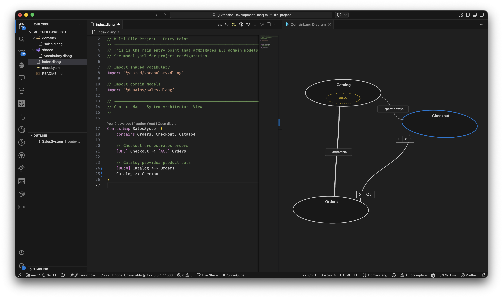

# DomainLang

Define your domains, bounded contexts, context maps, and team ownership in a concise `.dlang` syntax — with full editor support in VS Code.

DomainLang brings Domain-Driven Design modeling into your editor. You get syntax highlighting, IntelliSense, real-time validation, formatting, and navigation features that make `.dlang` files feel like first-class citizens alongside your code.



## Get started in two minutes

1. Install the extension from the [VS Code Marketplace](https://marketplace.visualstudio.com/items?itemName=DomainLang.vscode-domainlang).
2. Create a file with a `.dlang` extension.
3. Start modeling:

```dlang
Domain Commerce {
  vision: "Deliver seamless customer buying experiences"
}

Team SalesTeam
Team PaymentsTeam
Classification Core

bc OrderContext for Commerce as Core by SalesTeam {
  description: "Owns the order lifecycle"
}

bc PaymentContext for Commerce as Core by PaymentsTeam {
  description: "Owns payment authorization and capture"
}

ContextMap CommerceMap {
  contains OrderContext, PaymentContext
  [OHS] OrderContext -> [ACL] PaymentContext
}
```

As you type, DomainLang validates your model, auto-completes references, and shows inline documentation on hover. Formatting keeps your models consistent, and go-to-definition lets you navigate large models instantly.

## Editor features

- Syntax highlighting for `.dlang` files
- IntelliSense with keyword and cross-reference completion
- Real-time validation with actionable diagnostics
- Hover documentation for every element
- Go to definition and find references
- Document formatting
- Syntax highlighting in Markdown fenced code blocks

## AI tools for Copilot and agents

The extension exposes four language model tools that any VS Code agent can call:

| Tool | What it does |
| --- | --- |
| `domainlang_validate` | Validate a model or workspace and return diagnostics |
| `domainlang_list` | List and filter domains, bounded contexts, teams, and more |
| `domainlang_get` | Retrieve element details or a high-level model summary |
| `domainlang_explain` | Get a rich Markdown explanation of any element by FQN |

Try these prompts with Copilot Chat:

- "Validate my DomainLang model."
- "List all bounded contexts owned by PaymentsTeam."
- "Explain Acme.Sales.OrderContext."

## Extension settings

| Setting | Default | Description |
| --- | --- | --- |
| `domainlang.lsp.traceImports` | `false` | Log detailed import resolution traces in language server output |
| `domainlang.lsp.infoLogs` | `false` | Log info-level messages and timing in language server output |

## Requirements

VS Code 1.109.0 or later.

## Documentation

- [Getting started](https://domainlang.net/guide/getting-started)
- [VS Code extension guide](https://domainlang.net/guide/vscode-extension)
- [VS Code AI tools guide](https://domainlang.net/guide/vscode-tools)
- [Language reference](https://domainlang.net/reference/language)

## Feedback and issues

Found a bug or have a feature idea? Open an issue on [GitHub](https://github.com/DomainLang/DomainLang/issues).

## License

Apache-2.0
